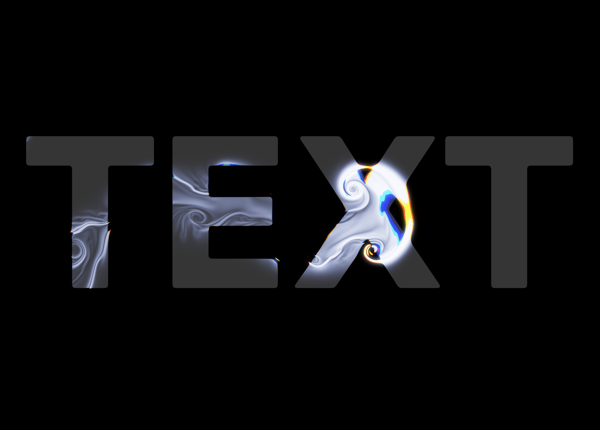

# Liquid Glass Text

**A cursor-driven fluid simulation, rendered as glass over a wordmark.**



**[🎨 View Live Demo](https://www.riufukazawa.com/liquid-glass-text)**

A real-time Navier–Stokes fluid runs on the GPU and becomes the *material* of a piece of type. Move your cursor across the letters and the liquid pushes, swirls, refracts and colours them. There are two readings of the same idea — the liquid is the glass, or the letters are the glass — and you can switch between them live.

Everything is **one self-contained HTML file**. No build step, no dependencies, no server. Double-click it and it runs.

[](LICENSE)


---

## Quick start

```bash
git clone https://github.com/Riu-F/liquid-glass-text.git
cd liquid-glass-text
open index.html          # macOS   (or: just double-click the file)
```

That's it. There is nothing to install.

**Requirements**

- A browser with **WebGL2** and float-texture rendering (`EXT_color_buffer_float`) — any recent Chrome, Edge, Firefox or Safari. Desktop Chrome is the safest bet.
- An internet connection the *first* time, so the Inter webfont can load. Everything else runs locally. Without it, the page falls back to a system sans-serif and still works.

If you get a message instead of the effect, your browser or GPU can't render to the float textures the fluid needs.

## Using it

Move your cursor across the letters to push the fluid around. The page auto-plays a short intro sweep, then hands over to you.

- **Toggle at the top centre** switches between the two looks. The fluid you've stirred up carries over, so you can see the same swirl rendered both ways.
- **Each look keeps its own control panel** (top right) with its own settings, so switching back and forth doesn't lose your tweaks.
- **Text field** at the top of either panel changes the wordmark live. Space-separated words stack onto their own lines.
- **Clear** wipes the current fluid.

## The two looks

### Liquid over text *(default)*

The flowing liquid **is** the glass, revealed only inside the letterforms like a mask, with prismatic "chrome" edges. The more cinematic, fluid-forward treatment.

### Refraction letters

The letters themselves **are** the glass. As fluid moves near a letter, the whole letter lights up as one coherent piece and refracts the fluid through itself. The more contained, "typographic" treatment. Defaults to a purple gradient.

Both run on the same fluid engine — only the final display shader differs.

## How it works — the layers

One WebGL2 pipeline, drawn every frame:

1. **Fluid simulation — the motion.** A GPU Navier–Stokes solver: your cursor injects velocity and "dye", then each frame runs curl/vorticity (adds swirl), a divergence pass and a Jacobi pressure solve (makes the flow incompressible, i.e. fluid-like), and semi-Lagrangian advection (carries everything downstream) — all ping-ponging between float textures. This is the engine; both looks share it.

2. **Text mask — the shape.** The wordmark is rasterised to a 2-D canvas and uploaded as two textures: a crisp mask (*is this pixel inside a letter?*) and a heavily-blurred "field" whose gradient yields smooth letter-edge normals — a cheap stand-in for a signed-distance field, used for refraction.

3. **Glass display shader — the material.** A single `uMode` uniform picks the reading:
   - *Liquid over text* masks the fluid to the letters and treats the liquid as glass. Chrome edges come from sampling the mask per colour channel at slightly offset positions (chromatic aberration).
   - *Refraction letters* treats the letterforms as glass, lighting and refracting them, coloured through a gradient palette.

4. **Colour — carried by the fluid.** Each splat encodes its hue as a **unit direction vector** in the dye's spare channels. Because the fluid's dissipation scales all channels uniformly and `atan2` is scale-invariant, the hue *survives the fade* and flows and mixes along with the liquid. Turn **Rainbow spread** up and the injected hue drifts over time, so the stream streaks through the spectrum — the same time-cycling colour trick as the original WebGL fluid demo, rather than a static spatial rainbow.

5. **Bloom + tonemap — the finish.** Bright areas are thresholded, blurred, added back, then ACES-tonemapped and gamma-corrected for the glossy HDR look.

## Controls

<details>
<summary><strong>Liquid over text</strong></summary>

| Control | What it does |
| --- | --- |
| Liquid width | Thickness of the liquid ribbon. |
| Flow force | How hard the cursor pushes the fluid. |
| Swirl | Turbulence / curl. Higher = more eddies. |
| Colour fade | How fast the liquid disappears after you stop. |
| Calm (viscosity) | How quickly motion settles. |
| Mask (hide outside) | High keeps liquid inside the letters; low lets it bleed out. |
| Refraction (bend) | How much the liquid warps the letter edges. |
| Refraction reach | Hard limit on how far from a letter refraction can appear. |
| Chromatic | The prismatic "chrome" edge fringing. Independent of colour. |
| Fluid colour | Amount of a single tint colour. 0 = pure chrome. |
| Colour hue | Picks the tint colour along a rainbow track. |
| Rainbow spread | 0 = one solid colour. Higher cycles the hue over time. |
| Rim glow | Brightness of the highlight along the liquid's edge. |
| Letter visibility | How present the letters are when no liquid is on them. |
| Bloom | Soft glow on the brightest parts. |

</details>

<details>
<summary><strong>Refraction letters</strong></summary>

| Control | What it does |
| --- | --- |
| Liquid width, Flow force, Swirl, Colour fade, Calm | Same fluid controls as above. |
| Refraction (inward) | How strongly the letters bend the fluid. |
| Seam (split look) | 0 refracts the whole letter as one coherent piece; 1 uses the letter's own shape, showing an inner/outer split. |
| Chromatic | Prismatic edge fringing. |
| Fill spread | How much of a letter lights up as a single entity when fluid is near. |
| Rim / outline | Brightness of the glassy edge. |
| Letter grey | How visible the letters are when unlit. |
| Colour hue | Picks the colour along the rainbow track — the colour you drag to is the colour that appears. The default (~0.67) is the original purple. |
| Rainbow spread | 0 keeps a single palette. Higher cycles the hue over time. |
| Bloom | Soft glow. Keep low for a crisp look. |
| Fluid behind / Mask (hide outside) | Control the faint fluid shown outside the letters. |

</details>

## Changing the wordmark

Type into the **Text** field in either panel to change it live. To change the default, edit the top of the `<script>` in `index.html`:

```js
let WORDS = ['TEXT'];   // default wordmark; space-separated words stack on their own lines
```

The layout sizes itself to fit.

## Repo layout

```
index.html      the entire app — markup, CSS, shaders and JS in one file
assets/hero.jpg the screenshot above
LICENSE         MIT
```

Kept deliberately as a **single file**. It's a self-contained visual demo, so the ability to double-click it, drop it on a site, or paste it into a CodePen matters more than module boundaries. Splitting the shaders and JS out would force a bundler or a local server just to run it. The script is sectioned with comments (`[fluid programs]`, `[text mask]`, `[display]`, `[bloom + tonemap]`) and opens with a header comment mapping the pipeline.

## Prior art & inspiration

The fluid and the glass are both well-trodden individually. What's less common is wiring a **live fluid simulation into the glass material of a wordmark**, and offering both readings from one shared engine.

- **The fluid engine** — [Pavel Dobryakov's WebGL Fluid Simulation](https://github.com/PavelDoGreat/WebGL-Fluid-Simulation) (MIT). The canonical browser Navier–Stokes solver that most of these effects, including this one, build on. The solver here follows the same technique, and the time-cycling rainbow is borrowed directly from it.
- **Fluid revealed inside text** *(closest prior art)* — Ksenia Kondrashova's [WebGL Fluid Simulation With Your Text](https://codepen.io/ksenia-k/pen/MWMObrY) and [WebGL liquid masking](https://codepen.io/ksenia-k/details/dyaeGgO). The same masking idea as "liquid over text".
- **Fluid distortion through a type cutout** — the [WebGL Liquid Distortion Typography Mask](https://freefrontend.com/code/webgl-liquid-distortion-typography-mask-2026-04-28/): a mouse-driven flow texture with per-channel RGB offset, revealed through an SVG cutout.
- **Liquid glass as a material** — Apple's *Liquid Glass* (June 2025) prompted a wave of web recreations such as [liquidGL](https://github.com/naughtyduk/liquidGL) and [liquid-glass-js](https://dashersw.github.io/liquid-glass-js/). Those refract a *static* DOM backdrop, not a live fluid.
- **Glass letterforms** — the [liquid-glass typography trend](https://fontvibe.ai/blog/liquid-glass-font) (crown highlights, refractive gradients), which the "refraction letters" mode evokes.

## Notes

- The control panels exist for exploring and choosing a direction. In a production build you'd fix the values you like and drop the panel.
- The glass, refraction, colour and bloom layers are original; the fluid solver follows Dobryakov's well-known approach.

## Credits

Fluid solver based on [WebGL-Fluid-Simulation](https://github.com/PavelDoGreat/WebGL-Fluid-Simulation) by Pavel Dobryakov (MIT). Typeface: [Inter](https://rsms.me/inter/) by Rasmus Andersson.

## License

[MIT](LICENSE) © 2026 Riu Fukazawa
